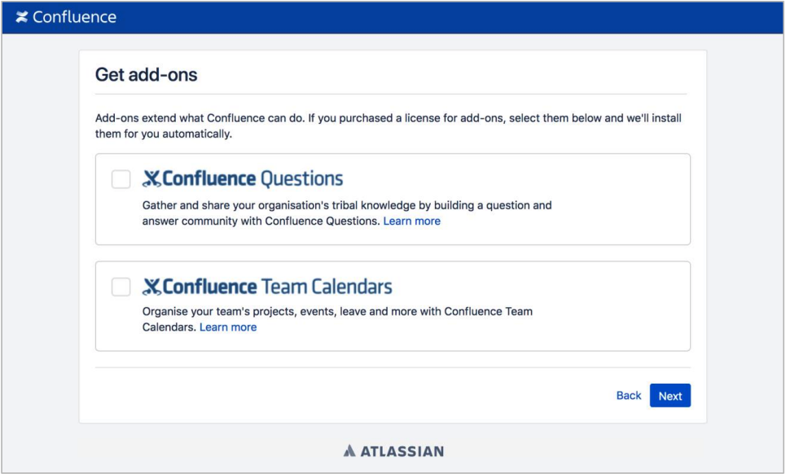
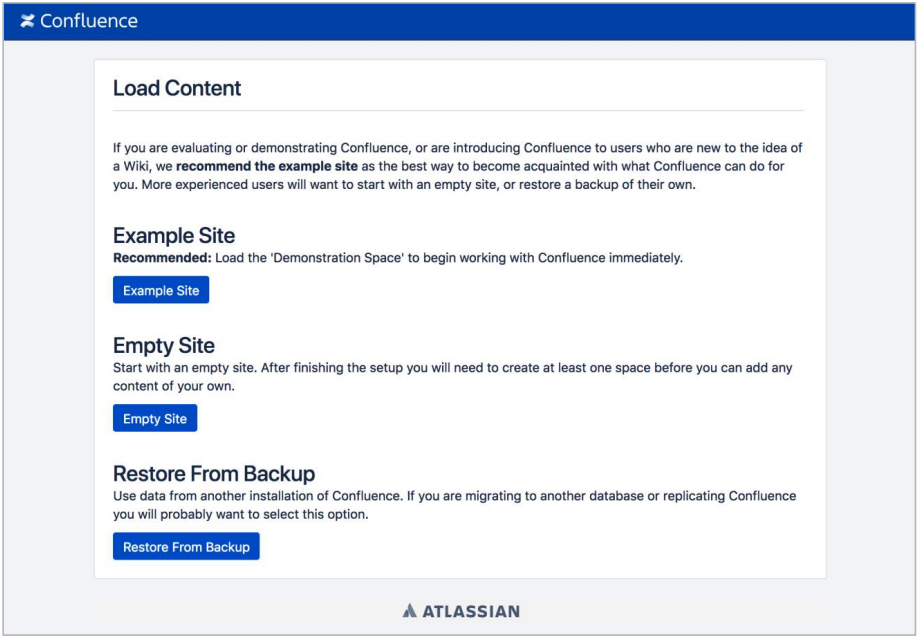
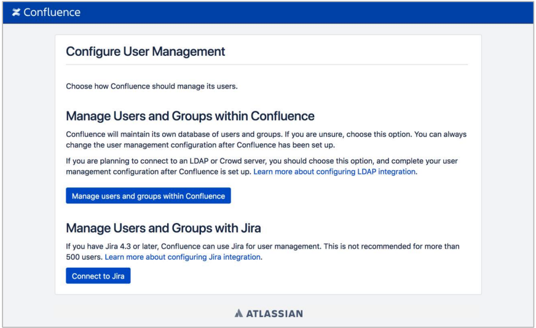

. Choose the URL that is displayed in the *Outputs* tab of the AWS CloudFormation stack to go to the {partner-product-name-short} configuration page.
+
IMPORTANT: If you get an https://confluence.atlassian.com/kb/network-and-connectivity-troubleshooting-guide-720405335.html[HTTP Error 503] response when you access the URL, it means that {partner-product-name-short} is still loading. This is expected, and you should wait a couple of minutes before trying again.
. In the *Get add-ons* page, choose *Next*. You can enable add-ons after setup if you wish.
+
.Get add-ons

. On the *License key* page, enter a valid Confluence Data Center license, and then choose Next. If you don’t have a valid license for Confluence Data Center, choose *Get an evaluation license*. You’ll be taken to http://my.atlassian.com where you can generate an evaluation license. You can’t use a Confluence Server license with this Quick Start.
+
.License key
image::../images/qs-step3-connie-license.png[width=640]
. On the *Load Content* page, choose *Example Site*.
+
.Load Content

. On the *Configure User Management* page, choose *Manage Users and Groups within Confluence*.
+
.Configure User Management

. To set up Confluence Data Center, you need to create an administrator account and password. The administrator account has full access to all data in Confluence, so we highly recommend that you choose a strong password for this account. Enter the administrator’s user details, and then choose *Next*.
+
.Configure System Administrator Account
image::../images/qs-step6-connie-sysadmin-account.png[width=640]
. You should now see the *Setup Successful* page. Choose *Further configuration* to go directly to the Confluence administration console, and log in with the administrator user account you created in the previous step.
+
.Administrator Access
image::../images/qs-step7-connie-loggingin.png[width=640]
. Go to *Clustering* in the administration console sidebar. You should see a page similar to the one below, which shows that the node is ready for clustering.
+
.Clustering (single node)
image::../images/qs-step8-connie-sndc.png[width=640]

Your Confluence Data Center deployment is now in a state where you can add nodes that will automatically cluster with your existing node.
