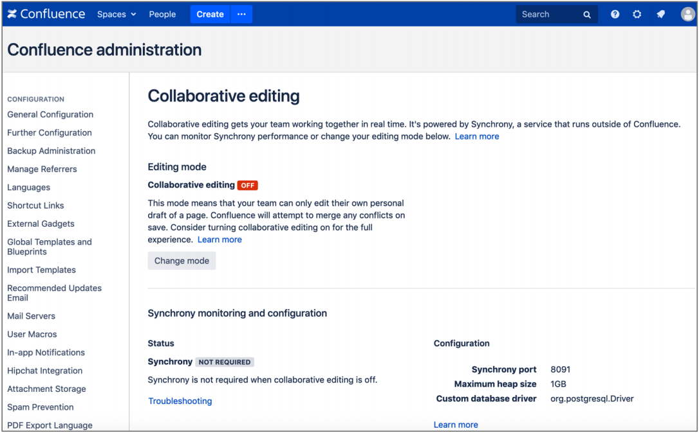
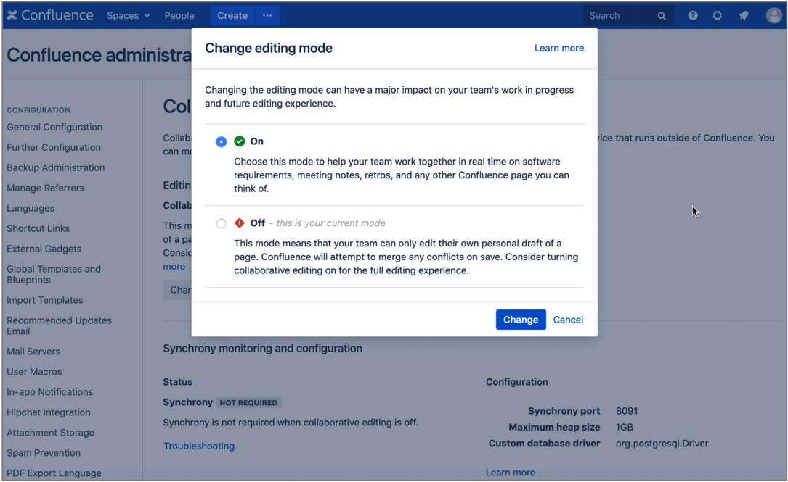
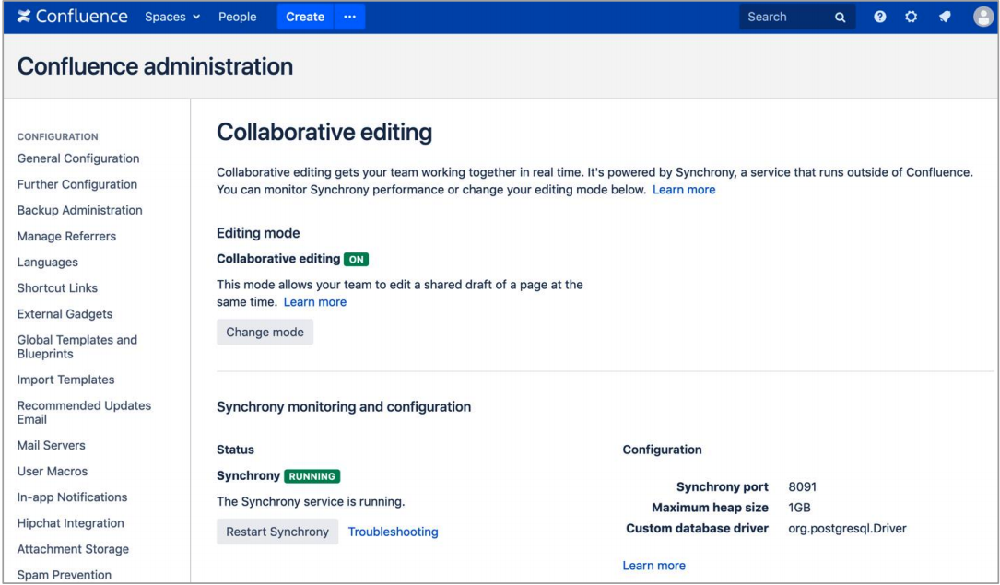

== Configuring {partner-product-name-short}

The following procedure helps you set up your new {partner-product-name-short} deployment.

include::./_config_application.adoc[]

=== Adding nodes to the {partner-product-name-short} cluster

By default, your Quick Start deployment starts with a single {partner-product-name-short} node (Auto Scaling group of `min=1` and `max=1`). When you're ready to add nodes to your cluster, perform the following steps:

.	Sign in to the AWS Management Console, use the Region selector in the navigation bar to choose the AWS Region for your deployment, and open the AWS CloudFormation console at https://console.aws.amazon.com/cloudformation/.
.	Choose the {partner-product-name-short} stack. From the *Actions* list, choose *Update Stack*.
.	On the *Select Template* page, leave *Use current template* selected, and then choose *Next*.
.	On the *Specify Details* page, in the *{partner-product-name-short} Setup* section of *Parameters*, enter the number of cluster nodes in *Minimum number of cluster nodes* and *Maximum number of cluster nodes*, and then click through to update the stack. This step sets a static number of nodes in your cluster.
. After the stack finishes updating, verify the number of nodes in your {partner-product-name-short} cluster. Choose *Clustering* again from the administration console sidebar. The following example shows a cluster that is scaled up to three instances.
+
.Clustering (multiple nodes)
image::../images/qs-step9-connie-clustering.png[]

=== (Optional) Adding nodes to the stand-alone Synchrony cluster

NOTE: Proceed with this step only if you set *Collaborative editing mode* to *synchrony-separate-nodes (Standalone Synchrony cluster)*.

.	Sign in to the AWS Management Console, use the Region selector in the navigation bar to choose the AWS Region for your deployment, and open the AWS CloudFormation console at https://console.aws.amazon.com/cloudformation/.
.	Choose the {partner-product-name-short} stack. From the *Actions* list, choose *Update Stack*.
.	On the *Select Template* page, leave *Use current template* selected, and then choose *Next*.
.	On the *Specify Details* page, in the *{partner-product-name-short} Setup* section of *Parameters*, enter the number of cluster nodes in *Minimum number of Synchrony cluster nodes* and *Maximum number of Synchrony cluster nodes*, and then click through to update the stack. This step sets a static number of nodes in your cluster.

=== (If needed) Enabling collaborative editing

NOTE: In older versions of Confluence Data Center, Collaborative Editing is disabled by default. If it is, you’ll need to manually enable it.

. In Confluence Data Center, go to image:icon-gear.png[] *> General Configuration > Collaborative editing*, and check whether collaborative editing is disabled (*off*).
+
.Collaborative editing (off)

. If *Collaborative editing* is disabled, choose *Change Mode*. From the *Change editing mode* page, choose *On*, and then choose *Change*.
+
.Change editing mode

. Verify that collaborative editing is on and that the status of Synchrony is *Running*.
+
.Collaborative editing (on)

// == Best practices for using {partner-product-name} on AWS
// Provide post-deployment best practices for using the technology on AWS, including considerations such as migrating data, backups, ensuring high performance, high availability, etc. Link to software documentation for detailed information.

// _Add any best practices for using the software._

// == Security
// Provide post-deployment best practices for using the technology on AWS, including considerations such as migrating data, backups, ensuring high performance, high availability, etc. Link to software documentation for detailed information.

// _Add any security-related information._

// == Other useful information
//Provide any other information of interest to users, especially focusing on areas where AWS or cloud usage differs from on-premises usage.

// _Add any other details that will help the customer use the software on AWS._
